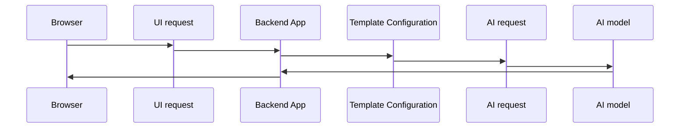

<div style="max-width: 1920px; margin: 0 auto;">

# OmniAssist


---

### OmniAssist Vector Database schema 

```json
{
    "id":"UUIDv4",                                               
    "vector": "[floats]",                               
    "payload": {        
        "libraryId":"string",
        "libraryDescription":"string",
        "documentName":"string",
        "contentId":"string",
        "content":"string"
    }             
}
```

### OmniAssist UI request 

```json
{
    "templateName": "string",                              
    "history": [                                        
        {
            "type": "previousSummary",
            "content": {
                "summary": "string"               
            }            
        },
        {
            "type": "questionResponse",
            "content": {
                "question": "string",
                "response": "string"
            }
        }
    ],
    "inputPrompts": [
        {
            "key":"value",
            "base64Encoded": "true|false"
        },
        {
            "key":"value",
            "base64Encoded": "true|false"
        },
        {
            "key":"value",
            "base64Encoded": "true|false"
        }
    ]
}
```

### OmniAssist Configuration file 

```json
{
    "generalConfiguration": {
        "dbConnectString": "string",                    
        "contentFolder": "string",                      
        "aiModels":[
            {
                "modelName":"string",                   
                "class":"string",                       
                "embeddingModel":"string",              
                "embeddingEndPoint":"string",           
                "completionModel":"string",             
                "completionEndPoint":"string",          
                "authenticationToken":"string",
                "temperature":"string"
            }
        ]
    },
    "templates": [        
        "string"
        "string",
        "string"            
    ]
}
```

### Template Configuration file 
```json
{
        
    "templateName": "string",                       
    "aiModelName":"string",
    "preHistoryPrompt": "string",                      
    "ragAttributes": {                          
        "libraryId":"number",
        "preContentPrompt":"string",
        "matchesNum":"number"   
        
    },   
    "historyHandler": {
        "preHistoryPrompt": "string",  
        "maxHistoryItems":"number"
    },                  
    "inputPromptHandlers": [                      
        {
            "conditions": [                
                 {
                    "input prompt key":"input prompt value"
                },
                {
                    "input prompt key":"input prompt value"
                }
            ],                                           
            "useInRag":"true|false",              
            "useInHistory":"true|flag",
            "inputPrompts": [
                {
                    "key":"string",
                    "default":"string",                  
                    "failIfEmpty":"true|false"
                },
                {
                    "key":"string",
                    "default":"string",
                    "failIfEmpty":"true|false"
                },
                {
                    "key":"string",
                    "default":"string",                    
                    "failIfEmpty":"true|false"
                }
            ],
            "prompt": [
                "string",
                "string {{attribute key}}",
                "string {{attribute key}} string {{attribute key}}",
                "string"
            ]   
        },
         {
            "conditions": [                
                {
                    "input prompt key":"input prompt value"
                },
                {
                    "input prompt key":"input prompt value"
                }
            ],                                           
            "useInRag":"true|false",              
            "useInHistory":"true|flag", 
            "inputPrompts": [
                {
                    "key":"string",
                    "default":"string",                 
                    "failIfEmpty":"true|false"
                },
                {
                    "key":"string",
                    "default":"string",                    
                    "failIfEmpty":"true|false"
                },
                {
                    "key":"string",
                    "default":"string",                    
                    "failIfEmpty":"true|false"
                }
            ],
            "prompt": [
                "string",
                "string {{attribute key}}",
                "string {{attribute key}} string {{attribute key}}",
                "string"
            ]            
        }
    ]      
    
}
```

---

## Examples

### Configuration file: 

```json
{
    "generalConfiguration": {
        "dbConnectString": "jdbc:sqlserver://172.31.53.200\\MAI_DEMO;Database=OmniAssist;user=sa;password=!Pr0t3ct3d",
        "contentFolder": "C:\\OmniAssist\\Content",       
        "aiModels":[
            {
                "modelName":"CHATGPT40",
                "class":"com.mai.aiapis.OpenAiApi",
                "embeddingModel":"text-embedding-ada-002",
                "embeddingEndPoint":"https: //api.openai.com/v1/embeddings",
                "completionModel":"gpt-3.5-turbo",
                "completionEndPoint":"https://api.openai.com/v1/chat/completions",
                "authenticationToken":"*************",
                "temperature":"0"
            },
            {
                "modelName":"LLAMA",
                "class":"com.mai.aiapis.LlamaAiApi",
                "embeddingModel":"llama3.2",
                "embeddingEndPoint":"http://localhost:11434/api/generate",
                "completionModel":"llama3.2",
                "completionEndPoint":"http://localhost:11434/api/generate",
                "authenticationToken":null,
                "temperature":"0"
            }
        ]
    },
     "templates": [        
        "MedicareClaimsAssstantAgent.json",
        "AppointmentAssistance.json"
    ]
}
```
---

### Medicare Claims Assistan Template Configuration file: 
```json
{
        
    "templateName": "WPSAgent",                    
    "aiModelName":"CHATGPT40",       
    "historyHandler": {
        "preHistoryPrompt": "Here is the interaction so far:",  
        "maxHistoryItems":5
    },                      
    "inputPromptHandlers": [
        {                             
            "prompt": "You are a Medicare Customer Service Representative for WPS Health Solutions."
        },
        {                                                                 
            "useInRag":false,              
            "useInHistory":true, 
            "inputPrompts": [
                {
                    "key":"claimData",                    
                    "failIfEmpty":true
                },
                {
                    "key":"referenceInfo",                    
                    "failIfEmpty":true
                },
                {                   
                    "key":"additionalInfo",                    
                    "failIfEmpty":true
                }
            ]                      
            "prompt": [
                "Here are the details of Medicare Claim Status: {{claimData}}.\n",
                "Here are the additional reference information of the Medicare Claim data mentioned above:{{referenceInfo}}\n",
                "Additional info:{{additionalInfo}}"
            ]                 
        },
        {
            "conditions": [
                {
                    "sequence":"I"
                }
            ],         
            "useInRag":false,              
            "useInHistory":true,            
            "prompt": [
                "Please give me a claim summary that is a few sentences in plain English that includes the DCN, the submitted date, ",
                "the attending physician, the service date, the status and location 1 code and the location 1 code description. ",
                "Please only provide the summary."        
            ]
        },
        {
            "conditions": [
                {
                    "sequence":"S"
                }
            ],    
            "useInRag":false,              
            "useInHistory":true,  
            "inputPrompts": [
                {
                    "key":"question",
                    "default":"Am I a good patient?!",                                       
                    "failIfEmpty":false
                } 
            ],                  
            "prompt": [
                "Please answer the following in full sentences without using bulleted lists or parentheses only using the information given above. ",
                "If the information is not explicitly given above, please only respond  \"!!UNKNOWN!!\" if the question asks for next claim, only respond \"!!NEXT!!\", ",
                "if the question asks for previous claim, only respond \"!!PREV!!\", if the the person indicates they are done, only respond \"!!DONE!!\",",
                "if the question asks for an operator or agent, only respond \"!!AGENT!!\"\n\n {{question}}",                                
            ]
        },
        {
            "conditions": [
                {
                    "voiceFlag":"N"
                }
            ],         
            "useInRag":false,              
            "useInHistory":false,                 
            "prompt": [
                "Produce the response as a JSON object. textContent attribute includes your regular text response."
            ]                  
        },    
        {
            "conditions": [
                {
                    "voiceFlag":"Y"
                }
            ],      
            "useInRag":false,              
            "useInHistory":false,                  
            "prompt": [
                "Produce the response as a JSON object.\n textContent attribute includes your regular text response.\n ",
                "ssmlContent attribute includes version of the response in ssml format. Use AWS SSML standard.\n Wrap ssml content with <speak> tags.\n ",
                "Wrap dates and years with <say-as interpret-as=''date''> ssml tag. \n Wrap money amounts with <say-as interpret-as=''currency''> ssml ",
                "tag and with a dollar sign $ before the amount value.\n Wrap  phone numbers with <say-as interpret-as=''telephone''>\n Don''t treat names ",
                "or places as the alphanumeric values.\n Remove all dots and dashes from the alphanumeric diagnostic codes. For example remove the dots from ",
                "codes like F90.9, F43.10, F31.9 \n When a sentence includes mixed alphanumeric identifiers (like check numbers such as 'EFT12345678'), split ",
                "letters and digits using <say-as> tags so they are spoken clearly. Use interpret-as=characters' for letters and interpret-as=''digits'' for ",
                "numbers. Insert a brief <break time=''50ms''/> between letters and digits to improve clarity.\n If the alphanumeric string is a Medicare claim ",
                "Document Control Number (DCN): Group into: four 3-digit chunks and the remaining characters in the final chunk. Wrap each chunk with individual ",
                "<say-as interpret-as=''digits''>,  but if the chunk contains letters,  use individual <say-as interpret-as=''characters''> for each character, ",
                "insert a 50ms break tag after each. Insert a comma after each chunk, a period after the last chunk.\n Avoid putting the entire string into a ",
                "single <say-as interpret-as=''characters''>.\n Wrap numbers, that are neither dates nor years nor part of the alphanumeric value with ",
                "<say-as interpret-as=''digits''> ssml tag.\n When a number appears in part of a sentence, use say-as cardinal tags. For example 120 days.\n ",
                "Split long numbers on 4 digits groups. Put space between the groups. \n For alphanumeric values put space after every letter and put space after ",
                "every 4 digits.\n Don''t wrap alphanumeric value with any ssml tags."                 
            ]
        }           
    ]
}
```       
### Medicare Claims Assistant UI request 

```json
{
    "templateName": "WPSClaims",    
    "inputPrompts": [
        {
            "key": "additionalInfo",
            "value": "TG9jYXRpb24gY29kZSBkZXNjcmlwdGlvbnM6ClAgQjk5OTYgUGF5bWVudCBmbG9vciAKUCBCOTk5NyBQYWlkL1Byb2Nl.....",
            "base64Encoded": true
        },
        {
            "key": "referenceInfo",
            "value": "PENsYWltSW5mbz4KCTxpbmZvPgoJCTxjYXRlZ29yeT5DbGFpbSBSZWFzb24gQ29kZTwvY2F0ZWdvcnk+CgkJPGNhdGVnb3J5X2R....",
            "base64Encoded": true
        },
        {
            "key": "sequence",
            "value": "S",
            "base64Encoded": false
        },
        {
            "key": "claimData",
            "value":"PENsYWltSW5mbz4KICA8aW5mbz4KICAgIDxjYXRlZ29yeT5OUEk8L2NhdGVnb3J5PgogICAgPGNhdGVnb3J5X2Rlc2NyaXB0aW9......",
            "base64Encoded": true
        },
        {
            "key": "question",
            "value": "How much do I own?",
            "base64Encoded": false
        },        
        {
            "key": "voiceFlag",
            "value": "Y",
            "base64Encoded": false
        }       
    ]
    
}
```
### Medicare Claims Assistant OpenAI request after going through the template configuration

```json
{
    "messages": [
        {
            "role": "user",
            "content": "You are a Medicare Customer Service Representative for WPS Health Solutions. "
        },
        {
            "role": "user",
            "content": "Here are the details of Medicare Claim Status:<ClaimInfo>, <info>, <category>NPI</category>, <category_description>National Provider Identifier</category_description>, <value>1581344899</value>, <value_meaning></value_meaning>, </info>, <info>, <category>PTAN</category>, <category_description>Provider Transaction Access Number</category_description>, <value>Z518498</value>, <value_meaning></value_meaning>, </info>, <info>, <category>Tax ID</category>, <category_description>Tax ID</category_description>, <value>56100</value>, <value_meaning></value_meaning>, </info>, <info>, <category>MBI</category>, <category_description>Medicare Beneficiary Identifier</category_description>, <value>ZDU9SL3ISQ0</value>, <value_meaning></value_meaning>, </info>, <info>, <category>Beneficiary Name</category>, <category_description></category_description>, <value>Jane Smith</value>, <value_meaning></value_meaning>, </info>, <info>, <category>DOB</category>, <category_description>Date of Birth</category_description>, <value>1/15/1960</value>, <value_meaning></value_meaning>, </info>, <info>, <category>DOS</category>, <category_description>Date of Service</category_description>, <value>9/5/2024</value>, <value_meaning></value_meaning>, </info>, <info>, <category>Receipt Date</category>, <category_description></category_description>, <value>1/10/2025</value>, <value_meaning></value_meaning>, </info>, <info>, <category>Beneficiary Liable Indicator</category>, <category_description></category_description>, <value>N</value>, <value_meaning></value_meaning>, </info>, <info>, <category>ANSI Reason Codes</category>, <category_description>American National Standards Institute Reason Codes</category_description>, <value>MA01</value>, <value_meaning>ALERT: IF YOU DO NOT AGREE WITH WHAT WE APPROVED FOR THESE SERVICES YOU MAY APPEAL OUR DECISION. TO MAKE SURE THAT WE ARE FAIR TO YOU WE REQUIRE ANOTHER INDIVIDUAL THAT DID NOT PROCESS YOUR INITIAL CLAIM TO CONDUCT THE APPEAL. HOWEVER IN ORDER TO BE ELIGIBLE FOR AN APPEAL YOU MUST WRITE TO US WITHIN 120 DAYS OF THE DATE YOU RECEIVED THIS NOTICE</value_meaning>, </info>, <info>, <category>ANSI Remark Code</category>, <category_description>American National Standards Institute Remark Codes</category_description>, <value>N435</value>, <value_meaning></value_meaning>, </info>, <info>, <category>Attending Physician</category>, <category_description></category_description>, <value>Denise Foster</value>, <value_meaning></value_meaning>, </info>, <info>, <category>Specialty Code</category>, <category_description></category_description>, <value>97</value>, <value_meaning></value_meaning>, </info>, <info>, <category>Location 1</category>, <category_description></category_description>, <value>B9997</value>, <value_meaning></value_meaning>, </info>, <info>, <category>Status</category>, <category_description></category_description>, <value>R</value>, <value_meaning>Processing Claim Rejection</value_meaning>, </info>, <info>, <category>Location 2</category>, <category_description></category_description>, <value>B9099</value>, <value_meaning></value_meaning>, </info>, <info>, <category>Status</category>, <category_description></category_description>, <value>S</value>, <value_meaning>Claims awaiting a response from a CWF host site</value_meaning>, </info>, <info>, <category>Location 3</category>, <category_description></category_description>, <value>B9000</value>, <value_meaning></value_meaning>, </info>, <info>, <category>Status</category>, <category_description></category_description>, <value>S</value>, <value_meaning>Claims ready to go to a common working file (CWF) host site</value_meaning>, </info>, <info>, <category>Location 4</category>, <category_description></category_description>, <value>B0100</value>, <value_meaning></value_meaning>, </info>, <info>, <category>Status</category>, <category_description></category_description>, <value>S</value>, <value_meaning>Beginning of the FISS batch process</value_meaning>, </info>, <info>, <category>Denial Letter Codes</category>, <category_description></category_description>, <value>39929</value>, <value_meaning></value_meaning>, </info>, <info>, <category>Bill Type</category>, <category_description></category_description>, <value>710</value>, <value_meaning></value_meaning>, </info>, <info>, <category>Total Billed Units</category>, <category_description></category_description>, <value>1</value>, <value_meaning></value_meaning>, </info>, <info>, <category>Submitted Charges</category>, <category_description></category_description>, <value>248</value>, <value_meaning></value_meaning>, </info>, <info>, <category>Allowed Charges</category>, <category_description></category_description>, <value>0</value>, <value_meaning></value_meaning>, </info>, <info>, <category>Non-Covered Charges</category>, <category_description></category_description>, <value>248</value>, <value_meaning></value_meaning>, </info>, <info>, <category>DCN</category>, <category_description>Document Control Number</category_description>, <value>225854442187MOA</value>, <value_meaning></value_meaning>, </info>, <info>, <category>Cancel Date</category>, <category_description></category_description>, <value>1/22/2025</value>, <value_meaning></value_meaning>, </info>, <info>, <category>Carrier Code</category>, <category_description></category_description>, <value>5302</value>, <value_meaning></value_meaning>, </info>, <info>, <category>Check Number</category>, <category_description></category_description>, <value>EFT6976555</value>, <value_meaning></value_meaning>, </info>, <info>, <category>Claim Location</category>, <category_description></category_description>, <value>B9997</value>, <value_meaning></value_meaning>, </info>, <info>, <category>Status</category>, <category_description></category_description>, <value>R</value>, <value_meaning>Processing Claim Rejection</value_meaning>, </info>, <info>, <category>Diagnosis Code 1</category>, <category_description></category_description>, <value>F909</value>, <value_meaning>attention-deficit hyperactivity (adolescent) (adult) (child)</value_meaning>, </info>, <info>, <category>Diagnosis Code 2</category>, <category_description></category_description>, <value>F419</value>, <value_meaning>Anxiety Disorder unspecified</value_meaning>, </info>, <info>, <category>Diagnosis Code 3</category>, <category_description></category_description>, <value>F319</value>, <value_meaning>Bipolar Disorder unspecified</value_meaning>, </info>, <info>, <category>Diagnosis Code 4</category>, <category_description></category_description>, <value>Z6828</value>, <value_meaning>Body Mass Index (BMI) of 28.0-28.9 for adults</value_meaning>, </info>, <info>, <category>Diagnosis Code 5</category>, <category_description></category_description>, <value>K219</value>, <value_meaning>Gastro-esophageal reflux disease (GERD) without esophagitis</value_meaning>, </info>, <info>, <category>Diagnosis Code 6</category>, <category_description></category_description>, <value>I10</value>, <value_meaning>Essential (primary) hypertension</value_meaning>, </info>, <info>, <category>Diagnosis Code 7</category>, <category_description></category_description>, <value>F4310</value>, <value_meaning>Post-Traumatic Stress Disorder (PTSD) unspecified</value_meaning>, </info>, <info>, <category>Diagnosis Code 8</category>, <category_description></category_description>, <value>E1165</value>, <value_meaning>Type 2 diabetes mellitus with hyperglycemia</value_meaning>, </info>, <info>, <category>Claim Reason Code</category>, <category_description></category_description>, <value>39929</value>, <value_meaning>THIS IS A CLAIM LEVEL REASON CODE FOR CLAIMS THAT HAVE ALL LINE ITEMS REJECTED AND/OR REJECTED AND DENIED. * CHECK LINE LEVEL TO DETERMINE WHY LINES WERE DENIED AND WHO IS LIABLE.</value_meaning>, </info>, <info>, <category>Attending Physician</category>, <category_description></category_description>, <value>Denise Foster</value>, <value_meaning></value_meaning>, </info>, <info>, <category>Taxonomy Code</category>, <category_description></category_description>, <value>261QR1300X</value>, <value_meaning></value_meaning>, </info>,</ClaimInfo>"
        },
        {
            "role": "user",
            "content": "Here are the additional reference information of the Medicare Claim data mentioned above:<ClaimInfo>, <info>, <category>Claim Reason Code</category>, <category_description></category_description>, <value>37205</value>, <value_meaning>a previously processed bill has been adjusted<value_meaning/>, </info>, <info>, <category>Subject to Part B Deductible</category>, <category_description></category_description>, <value>72.9</value>, <value_meaning><value_meaning/>, </info>, <info>, <category>Total Billed Units</category>, <category_description></category_description>, <value>1</value>, <value_meaning><value_meaning/>, </info>, <info>, <category>Cancel Date</category>, <category_description></category_description>, <value>1/22/2025</value>, <value_meaning><value_meaning/>, </info>, <info>, <category>Carrier Code</category>, <category_description></category_description>, <value>5302</value>, <value_meaning><value_meaning/>, </info>, <info>, <category>Check Number</category>, <category_description></category_description>, <value>EFT6976555</value>, <value_meaning><value_meaning/>, </info>, <info>, <category>Denial Letter Codes</category>, <category_description></category_description>, <value>39929</value>, <value_meaning><value_meaning/>, </info>, <info>, <category>ANSI Reason Codes</category>, <category_description>American National Standards Institute Reason Codes</category_description>, <value>MA01</value>, <value_meaning>ALERT: IF YOU DO NOT AGREE WITH WHAT WE APPROVED FOR THESE SERVICES, YOU MAY APPEAL OUR DECISION. TO MAKE SURE THAT WE ARE FAIR TO YOU, WE REQUIRE ANOTHER INDIVIDUAL THAT DID NOT PROCESS YOUR INITIAL CLAIM TO CONDUCT THE APPEAL. HOWEVER, IN ORDER TO BE ELIGIBLE FOR AN APPEAL, YOU MUST WRITE TO US WITHIN 120 DAYS OF THE DATE YOU RECEIVED THIS NOTICE<value_meaning/>, </info>, <info>, <category>ANSI Remark Code</category>, <category_description>American National Standards Institute Remark Codes</category_description>, <value>N435</value>, <value_meaning><value_meaning/>, </info>, <info>, <category>Remarks</category>, <category_description></category_description>, <value></value>, <value_meaning>CORRECTED CLAIM-99487 CHANGED TO G0511<value_meaning/>, </info>, <info>, <category>MSP</category>, <category_description>Medicare Secondary Payer</category_description>, <value>Yes</value>, <value_meaning>Medicare is the secondary payer<value_meaning/>, </info>, <info>, <category>SNF</category>, <category_description>Skilled Nursing Facility</category_description>, <value>No</value>, <value_meaning>Patient not in a Skilled Nursing Facility<value_meaning/>, </info>, <info>, <category>Location 2</category>, <category_description></category_description>, <value>B9996</value>, <value_meaning><value_meaning/>, </info>, <info>, <category>Status</category>, <category_description></category_description>, <value>P</value>, <value_meaning>Payment floor<value_meaning/>, </info>, <info>, <category>Location 3</category>, <category_description></category_description>, <value>B9099</value>, <value_meaning><value_meaning/>, </info>, <info>, <category>Status</category>, <category_description></category_description>, <value>S</value>, <value_meaning>Claims awaiting a response from a CWF host site<value_meaning/>, </info>, <info>, <category>Location 4</category>, <category_description></category_description>, <value>B9000</value>, <value_meaning><value_meaning/>, </info>, <info>, <category>Status</category>, <category_description></category_description>, <value>S</value>, <value_meaning>Claims ready to go to a common working file (CWF) host site<value_meaning/>, </info>, <info>, <category>Location 5</category>, <category_description></category_description>, <value>B0100</value>, <value_meaning><value_meaning/>, </info>, <info>, <category>Status</category>, <category_description></category_description>, <value>S</value>, <value_meaning>Beginning of the FISS batch process<value_meaning/>, </info>, <info>, <category>Location 6</category>, <category_description></category_description>, <value>MSPRA</value>, <value_meaning><value_meaning/>, </info>, <info>, <category>Status</category>, <category_description></category_description>, <value>S</value>, <value_meaning>Claim is being processed under Medicare Secondary Payer (MSP) rules<value_meaning/>, </info>, <info>, <category>Location 7</category>, <category_description></category_description>, <value>B0100</value>, <value_meaning><value_meaning/>, </info>, <info>, <category>Status</category>, <category_description></category_description>, <value>S</value>, <value_meaning>claim adjustment has been submitted to change a non-covered claim to a covered claim, but the appropriate claim change condition code (such as D1) was not billed<value_meaning/>, </info>, <info>, <category>Attending Physician</category>, <category_description></category_description>, <value>Denise Foster</value>, <value_meaning><value_meaning/>, </info>, <info>, <category>Specialty Code</category>, <category_description></category_description>, <value>97</value>, <value_meaning><value_meaning/>, </info>, <info>, <category>Taxonomy Code</category>, <category_description></category_description>, <value>261QR1300X</value>, <value_meaning><value_meaning/>, </info>, <info>, <category>Diagnosis Code 2</category>, <category_description></category_description>, <value>F419</value>, <value_meaning>Anxiety Disorder, unspecified<value_meaning/>, </info>, <info>, <category>Diagnosis Code 3</category>, <category_description></category_description>, <value>F319</value>, <value_meaning>Bipolar Disorder, unspecified<value_meaning/>, </info>, <info>, <category>Diagnosis Code 4</category>, <category_description></category_description>, <value>Z6828</value>, <value_meaning>Body Mass Index (BMI) of 28.0-28.9 for adults<value_meaning/>, </info>, <info>, <category>Diagnosis Code 5</category>, <category_description></category_description>, <value>K219</value>, <value_meaning>Gastro-esophageal reflux disease (GERD) without esophagitis<value_meaning/>, </info>, <info>, <category>Diagnosis Code 6</category>, <category_description></category_description>, <value>I10</value>, <value_meaning>Essential (primary) hypertension<value_meaning/>, </info>, <info>, <category>Diagnosis Code 7</category>, <category_description></category_description>, <value>F4310</value>, <value_meaning>Post-Traumatic Stress Disorder (PTSD), unspecified<value_meaning/>, </info>, <info>, <category>Diagnosis Code 8</category>, <category_description></category_description>, <value>E1165</value>, <value_meaning>Type 2 diabetes mellitus with hyperglycemia<value_meaning/>, </info>, <info>, <category>H2663</category>, <category_description>COVENTRY HEALTH CARE OF MISSOURI, INC.</category_description>, <value>1285 Fernridge Parkway, Suite 200 St. Louis MO 63141</value>, <value_meaning>1-800-533-0367<value_meaning/>, </info>,</ClaimInfo>"
        },
        {
            "role": "user",
            "content": "Location code descriptions:,P B9996 Payment floor ,P B9997 Paid/Processed claim ,P B7501 Post-pay review ,P B7505 Post-pay review ,R B9997 Claims processing rejection ,D B9997 Medical review denial ,T B9900 Daily return to provider (RTP) claim – not yet accessible ,T B9997 RTP claim – claim may be accessed and corrected through the Claim and Attachments Corrections Menu (Main menu option 03) ,S B0100 Beginning of the FISS batch process ,S B6000 Claims awaiting the creation of an additional development request (ADR) letter. Do not press [F9] on these claims because FISS will generate another ADR. ,S B6001 Claims awaiting a provider’s response to an ADR letter ,S B6099 Claims awaiting a provider’s response to an ADR letter ,S B9000 Claims ready to go to a common working file (CWF) host site ,S B9099 Claims awaiting a response from a CWF host site,"
        },
        {
            "role": "user",
            "content": "Please give me a claim summary that is a few sentences in plain English that includes the DCN, the submitted date, the attending physician, the service date, the status and location 1 code and the location 1 code description. Please only provide the summary.\r\n"
        }
        {
            "role": "user",
            "content": "This is customer's question:"
        },
        {
            "role": "user",
            "content": "How much do I own?"
        },
        {
            "role": "user",
            "content": "Produce the response as a JSON object.\\n textContent attribute includes your regular text response.\\n ssmlContent attribute includes version of the response in ssml format. Use AWS SSML standard.\\n Wrap ssml content with <speak> tags.\\n Wrap dates and years with <say-as interpret-as=''date''> ssml tag. \\n Wrap money amounts with <say-as interpret-as=''currency''> ssml tag and with a dollar sign $ before the amount value.\\n Wrap  phone numbers with <say-as interpret-as=''telephone''>\\n Don''t treat names or places as the alphanumeric values.\\n Remove all dots and dashes from the alphanumeric diagnostic codes. For example remove the dots from codes like F90.9, F43.10, F31.9 \\n Group the 5-digit alphanumeric location code into numeric and alphabetic parts. Use <say-as interpret-as=digits>  for the numeric part. For example B9997 should be B <say-as interpret-as=''digits''>9997</say-as> \\n For numeric strings longer than 4 digits, group them into 3-digit chunks, each with individual <say-as> tags and insert a comma after each chunk.\\n If the alphanumeric string is a Medicare claim Document Control Number (DCN): Group into: two 3-digit chunks, 3 2-digit chunks, and the remaining characters in the final chunk. Wrap each chunk with individual <say-as interpret-as=''digits''>,  but if the chunk contains letters,  use individual <say-as interpret-as=''characters''> for each character, insert a comma after each. Insert a comma after each chunk, a period after the last chunk.\\n Avoid putting the entire string into a single <say-as interpret-as=''characters''>.\\n Wrap numbers, that are neither dates nor years nor part of the alphanumeric value with <say-as interpret-as=''digits''> ssml tag.\\n Split long numbers on 4 digits groups. Put space between the groups. \\n For alphanumeric values put space after every letter and put space after every 4 digits.\\n Don''t wrap alphanumeric value with any ssml tags."
        }
    ]       
}
```
---

### Apppointment Assistant Template Configuration file: 
```json
{
        
    "templateName": "AppointmentAssistance",                    
    "aiModelName":"CHATGPT40",       
    "historyHandler": {
        "preHistoryPrompt": "Here is the interaction so far:",  
        "maxHistoryItems":3
    },                      
    "inputPromptHandlers": [
        {                             
            "prompt": "You are appointment assistant."
        },
        {        
            "useInRag":false,              
            "useInHistory":true,                                                          
            "inputPrompts": [
                {
                    "key":"avalilableTimeBlocks",                                    
                    "failIfEmpty":true
                },
                {
                    "key":"officeHours",                    
                    "default":"{\"officeHours\":[{\"day\":\"Monday\",\"startTime\":\"09:00:00-04:00\",\"endTime\":\"17:00:00-04:00\"},{\"day\":\"Tuesday\",\"startTime\":\"09:00:00-04:00\",\"endTime\":\"17:00:00-04:00\"},{\"day\":\"Wednesday\",\"startTime\":\"09:00:00-04:00\",\"endTime\":\"17:00:00-04:00\"},{\"day\":\"Thursday\",\"startTime\":\"09:00:00-04:00\",\"endTime\":\"17:00:00-04:00\"},{\"day\":\"Friday\",\"startTime\":\"09:00:00-04:00\",\"endTime\":\"17:00:00-04:00\"},{\"day\":\"Weekend\",\"startTime\":\"\",\"endTime\":\"\"},{\"day\":\"Federal holiday\",\"startTime\":\"\",\"endTime\":\"\"}]}",
                    "failIfEmpty":false
                }
            ] ,                  
            "prompt": [
                "You need to schedule a 30 minutes doctor appointment.These are the available time blocks {{avalilableTimeBlocks}}. ",
                "These are the office hours {{officeHours}}. Return me 30 minutes available timeslots between startTime and endTime."
            ]                 
        },
        {
            "useInRag":false,              
            "useInHistory":false, 
            "conditions": [
                {
                    "voiceFlag":"N"
                }
            ],                      
            "prompt": [
                "Produce the response as a JSON object. textContent attribute includes your regular text response."                  
            ]
        },    
        {
            "useInRag":false,              
            "useInHistory":false, 
            "conditions": [
                {
                    "voiceFlag":"Y"
                }
            ],                      
            "prompt": [
                "Produce the response as a JSON object.\n textContent attribute includes your regular text response.\n ssmlContent attribute includes version of the ", 
                "response in ssml format. Use AWS SSML standard.\n Wrap ssml content with <speak> tags.\n Wrap dates and years with <say-as interpret-as=''date''> ssml tag."                 
            ]
        }           
    ]
}
```       

### Apppointment Assistant UI request 

```json
{
    "templateName": "AppointmentAssistant",    
    "inputPrompts": [
        {
            "key": "avalilableTimeBlocks",
            "value": "{\"availableTimeSlots\":[{\"startTime\":\"2025-08-28T00:25:00-04:00\",\"endTime\":\"2025-08-29T23:59:59-04:00\"}]}"
        },
        {
            "key": "officeHours",
            "value": "{\"officeHours\":[{\"day\":\"Monday\",\"startTime\":\"09:00:00-04:00\",\"endTime\":\"17:00:00-04:00\"},{\"day\":\"Tuesday\",\"startTime\":\"09:00:00-04:00\",\"endTime\":\"17:00:00-04:00\"},{\"day\":\"Wednesday\",\"startTime\":\"09:00:00-04:00\",\"endTime\":\"17:00:00-04:00\"},{\"day\":\"Thursday\",\"startTime\":\"09:00:00-04:00\",\"endTime\":\"17:00:00-04:00\"},{\"day\":\"Friday\",\"startTime\":\"09:00:00-04:00\",\"endTime\":\"17:00:00-04:00\"},{\"day\":\"Weekend\",\"startTime\":\"\",\"endTime\":\"\"},{\"day\":\"Federal holiday\",\"startTime\":\"\",\"endTime\":\"\"},{\"day\":\"Israel independence Day\",\"startTime\":\"\",\"endTime\":\"\"},{\"day\":\"Day of Oktoberfest On TheSquare in Philadelphia\",\"startTime\":\"\",\"endTime\":\"\"}]}",
            "base64Encoded": false
        },
        {
            "key": "sequence",
            "value": "S",
            "base64Encoded": false
        }
        {
            "key": "question",
            "value": "How much do I own?"
            "base64Encoded": false
        },        
        {
            "key": "voiceFlag",
            "value": "Y",
            "base64Encoded": false
        }       
    ]
    
}
```

### Apppointment Assistant OpenAI request after going through the template configuration

```json
{
    "messages": [
        {
            "role": "user",
            "content": "You are appointment assistant."
        },
        {
            "role": "user",
            "content": "You need to schedule a 30 minutes doctor appointment.These are the available time blocks {\"availableTimeSblocks\":[{\"startTime\":\"2025-08-28T00:25:00-04:00\",\"endTime\":\"2025-08-29T23:59:59-04:00\"}]}. These are the office hours{\"officeHours\":[{\"day\":\"Monday\",\"startTime\":\"09:00:00-04:00\",\"endTime\":\"17:00:00-04:00\"},{\"day\":\"Tuesday\",\"startTime\":\"09:00:00-04:00\",\"endTime\":\"17:00:00-04:00\"},{\"day\":\"Wednesday\",\"startTime\":\"09:00:00-04:00\",\"endTime\":\"17:00:00-04:00\"},{\"day\":\"Thursday\",\"startTime\":\"09:00:00-04:00\",\"endTime\":\"17:00:00-04:00\"},{\"day\":\"Friday\",\"startTime\":\"09:00:00-04:00\",\"endTime\":\"17:00:00-04:00\"},{\"day\":\"Weekend\",\"startTime\":\"\",\"endTime\":\"\"},{\"day\":\"Federal holiday\",\"startTime\":\"\",\"endTime\":\"\"},{\"day\":\"Israel independence Day\",\"startTime\":\"\",\"endTime\":\"\"},{\"day\":\"Day of Oktoberfest On TheSquare in Philadelphia\",\"startTime\":\"\",\"endTime\":\"\"}]}. Return me 30 minutes available timeslots between startTime and endTime."
        },
        {
            "role": "user",
            "content": "Produce the response as a JSON object.\n textContent attribute includes your regular text response.\n ssmlContent attribute includes version of the response in ssml format. Use AWS SSML standard.\n Wrap ssml content with <speak> tags.\n Wrap dates and years with <say-as interpret-as=''date''> ssml tag."
        }
    ]       
}
```

</div>
