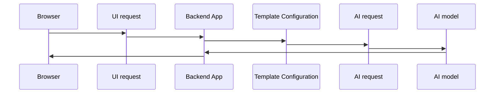

<div style="max-width: 1920px; margin: 0 auto;">

# OmniAssist


---

### OmniAssist Vector Database schema 

```json
{
    "id":"UUIDv4",                                               
    "vector": "[floats]",                               
    "payload": {        
        "libraryId":"string",
        "libraryDescription":"string",
        "documentName":"string",
        "contentId":"string",
        "content":"string"
    }             
}
```

### OmniAssist UI request 

```json
{
    "templateName": "string",                              
    "history": [                                        
        {
            "type": "previousSummary",
            "content": {
                "summary": "string"               
            }            
        },
        {
            "type": "questionResponse",
            "content": {
                "question": "string",
                "response": "string"
            }
        }
    ],
    "inputPrompts": [
        {
            "key":"string",
            "value":"string",
            "base64Encoded": "true|false"
        },
       {
            "key":"string",
            "value":"string",
            "base64Encoded": "true|false"
        },
        {
            "key":"string",
            "value":"string",
            "base64Encoded": "true|false"
        },
    ]
}
```

### OmniAssist Configuration file 

```json
{
    "generalConfiguration": {
        "dbConnectString": "string",                    
        "contentFolder": "string",                      
        "aiModels":[
            {
                "aiModelName":"string",                   
                "aiClass":"string",                       
                "embeddingModel":"string",              
                "embeddingEndPoint":"string",           
                "completionModel":"string",             
                "completionEndPoint":"string",          
                "authenticationToken":"string",
                "temperature":"string"
            }
        ]
    },
    "templates": [        
        "string"
        "string",
        "string"            
    ]
}
```

### Template Configuration file 
```json
{
        
    "templateName": "string",                       
    "aiModelName":"string",
    "preHistoryPrompt": "string",                      
    "ragAttributes": {                          
        "libraryId":"number",
        "preContentPrompt":"string",
        "matchesNum":"number"   
        
    },   
    "historyHandler": {
        "preHistoryPrompt": "string",  
        "maxHistoryItems":"number"
    },                  
    "inputPromptHandlers": [                      
        {
            "conditions": [                
                 {
                    "input prompt key":"string",
                    "input prompt value": "string"
                },
                {
                    "input prompt key":"string",
                    "input prompt value": "string"
                },
            ],                                           
            "useInRag":"true|false",              
            "useInHistory":"true|flag",
            "inputPrompts": [
                {
                    "key":"string",
                    "default":"string",                  
                    "failIfEmpty":"true|false"
                },
                {
                    "key":"string",
                    "default":"string",
                    "failIfEmpty":"true|false"
                },
                {
                    "key":"string",
                    "default":"string",                    
                    "failIfEmpty":"true|false"
                }
            ],
            "outputPrompt": [
                "string",
                "string {{input prompt key}}",
                "string {{input prompt key}} string {{input prompt key}}",
                "string"
            ]   
        },
         {
            "conditions": [                
                 {
                    "input prompt key":"string",
                    "input prompt value": "string"
                },
                {
                    "input prompt key":"string",
                    "input prompt value": "string"
                },
            ],                                           
            "useInRag":"true|false",              
            "useInHistory":"true|flag",
            "inputPrompts": [
                {
                    "key":"string",
                    "default":"string",                  
                    "failIfEmpty":"true|false"
                },
                {
                    "key":"string",
                    "default":"string",
                    "failIfEmpty":"true|false"
                },
                {
                    "key":"string",
                    "default":"string",                    
                    "failIfEmpty":"true|false"
                }
            ],
            "outputPrompt": [
                "string",
                "string {{input prompt key}}",
                "string {{input prompt key}} string {{input prompt key}}",
                "string"
            ]   
        }
    ]      
    
}
```

---

## Examples

### Configuration file: 

```json
{
    "generalConfiguration": {
        "dbConnectString": "jdbc:sqlserver://172.31.53.200\\MAI_DEMO;Database=OmniAssist;user=sa;password=!Pr0t3ct3d",
        "contentFolder": "C:\\OmniAssist\\Content",
        "aiModels": [
            {
                "aiModelName": "CHATGPT35",
                "aiClass": "com.mai.aiapis.OpenAiApi",
                "embeddingModel": "text-embedding-ada-002",
                "embeddingEndPoint": "https: //api.openai.com/v1/embeddings",
                "completionModel": "gpt-3.5-turbo",
                "completionEndPoint": "https://api.openai.com/v1/chat/completions",
                "authenticationToken": "**************",
                "temperature": "0"
            },
            {
                "aiModelName": "CHATGPT40",
                "aiClass": "com.mai.aiapis.OpenAiApi",
                "embeddingModel": "text-embedding-ada-002",
                "embeddingEndPoint": "https: //api.openai.com/v1/embeddings",
                "completionModel": "gpt-4.1",
                "completionEndPoint": "https://api.openai.com/v1/chat/completions",
                "authenticationToken": "**************",
                "temperature": "0"
            },
            {
                "aiModelName": "LLAMA",
                "aiClass": "com.mai.aiapis.LlamaAiApi",
                "embeddingModel": "llama3.2",
                "embeddingEndPoint": "http://localhost:11434/api/generate",
                "completionModel": "llama3.2",
                "completionEndPoint": "http://localhost:11434/api/generate",
                "authenticationToken": null,
                "temperature": "0"
            }
        ]
    },
    "templates": [
        "MedicareClaimsAssistantAgent",
        "RapidAssistantAgent",
        "AppointmentAssistance"
    ]
}
```
---

### Medicare Claims Assistant Template Configuration file: 
```json
{
    "templateName": "MedicareClaimsAssistantAgent",
    "aiModelName": "CHATGPT40",
    "historyHandler": {
        "preHistoryPrompt": "Here is the interaction so far:",
        "maxHistoryItems": 5
    },
    "inputPromptHandlers": [
        {
            "useInRag": false,
            "useInHistory": false,
            "outputPrompt": [
                "You are a Medicare Customer Service Representative for WPS Health Solutions."
            ]
        },
        {
            "conditions": [
                {
                    "key": "voiceFlag",
                    "value": "N"
                }
            ],
            "useInRag": false,
            "useInHistory": false,
            "inputPrompts": [
                {
                    "key": "claimData",
                    "failIfEmpty": true
                },
                {
                    "key": "referenceInfo",
                    "failIfEmpty": true
                },
                {
                    "key": "additionalInfo",
                    "failIfEmpty": true
                }
            ],
            "outputPrompt": [
                "Here are the details of Medicare Claim Status: {{claimData}}.\n",
                "Here are the additional reference information of the Medicare Claim data mentioned above:{{referenceInfo}}\n",
                "Additional info:{{additionalInfo}}"
            ]
        },
        {
            "conditions": [
                {
                    "key": "sequence",
                    "value": "I"
                },
                {
                    "key": "voiceFlag",
                    "value": "N"
                }
            ],
            "useInRag": false,
            "useInHistory": true,
            "outputPrompt": [
                "Please give me a claim summary that is a few sentences in plain English that includes the DCN, the submitted date, ",
                "the attending physician, the service date, the status and location 1 code and the location 1 code description. ",
                "Please only provide the summary."
            ]
        },
        {
            "conditions": [
                {
                    "key": "sequence",
                    "value": "S"
                },
                {
                    "key": "voiceFlag",
                    "value": "N"
                }
            ],
            "useInRag": false,
            "useInHistory": true,
            "inputPrompts": [
                {
                    "key": "question",
                    "default": "Am I a good patient?!",
                    "failIfEmpty": false
                }
            ],
            "outputPrompt": [
                "Please answer the following in full sentences without using bulleted lists or parentheses only using the information given above. ",
                "If the information is not explicitly given above, please only respond  '!!UNKNOWN!!' if the question asks for next claim, only respond '!!NEXT!!', ",
                "if the question asks for previous claim, only respond '!!PREV!!', if the the person indicates they are done, only respond '!!DONE!!',",
                "if the question asks for an operator or agent, only respond '!!AGENT!!'\n\n {{question}}"
            ]
        },
        {
            "conditions": [
                {
                    "key": "voiceFlag",
                    "value": "N"
                }
            ],
            "useInRag": false,
            "useInHistory": false,
            "outputPrompt": [
                "Produce the response as a JSON object. textContent attribute includes your regular text response."
            ]
        },
        {
            "conditions": [
                {
                    "key": "voiceFlag",
                    "value": "Y"
                }
            ],
            "inputPrompts": [
                {
                    "key": "text",
                    "failIfEmpty": true
                }
            ],
            "useInRag": false,
            "useInHistory": false,
            "outputPrompt": [
                "{{text}}\n",
                "Produce the response as a JSON object.\n textContent attribute includes the text provided above.\n ssmlContent attribute includes text provided above converted to ssml format.\n",
                "Use AWS SSML standard.\n Wrap ssml content with <speak> tags.\n ",
                "Wrap dates and years with <say-as interpret-as=''date''> ssml tag. \n Wrap money amounts with <say-as interpret-as=''currency''> ssml ",
                "tag and with a dollar sign $ before the amount value.\n Wrap  phone numbers with <say-as interpret-as=''telephone''>\n Don''t treat names ",
                "or places as the alphanumeric values.\n Remove all dots and dashes from the alphanumeric diagnostic codes. For example remove the dots from ",
                "codes like F90.9, F43.10, F31.9 \n When a sentence includes mixed alphanumeric identifiers (like check numbers such as 'EFT12345678'), split ",
                "letters and digits using <say-as> tags so they are spoken clearly. Use interpret-as=characters' for letters and interpret-as=''digits'' for ",
                "numbers. Insert a brief <break time=''50ms''/> between letters and digits to improve clarity.\n If the alphanumeric string is a Medicare claim ",
                "Document Control Number (DCN): Group into: four 3-digit chunks and the remaining characters in the final chunk. Wrap each chunk with individual ",
                "<say-as interpret-as=''digits''>,  but if the chunk contains letters,  use individual <say-as interpret-as=''characters''> for each character, ",
                "insert a 50ms break tag after each. Insert a comma after each chunk, a period after the last chunk.\n Avoid putting the entire string into a ",
                "single <say-as interpret-as=''characters''>.\n Wrap numbers, that are neither dates nor years nor part of the alphanumeric value with ",
                "<say-as interpret-as=''digits''> ssml tag.\n When a number appears in part of a sentence, use say-as cardinal tags. For example 120 days.\n ",
                "Split long numbers on 4 digits groups. Put space between the groups. \n For alphanumeric values put space after every letter and put space after ",
                "every 4 digits.\n Don''t wrap alphanumeric value with any ssml tags."
            ]
        }
    ]
}
```       
### Medicare Claims Assistant UI request 

```json
{
    "templateName": "MedicareClaimsAssstantAgent",    
    "inputPrompts": [
        {
            "key": "additionalInfo",
            "value": "TG9jYXRpb24gY29kZSBkZXNjcmlwdGlvbnM6ClAgQjk5OTYgUGF5bWVudCBmbG9vciAKUCBCOTk5NyBQYWlkL1Byb2Nl.....",
            "base64Encoded": true
        },
        {
            "key": "referenceInfo",
            "value": "PENsYWltSW5mbz4KCTxpbmZvPgoJCTxjYXRlZ29yeT5DbGFpbSBSZWFzb24gQ29kZTwvY2F0ZWdvcnk+CgkJPGNhdGVnb3J5X2R....",
            "base64Encoded": true
        },
        {
            "key": "sequence",
            "value": "S",
            "base64Encoded": false
        },
        {
            "key": "claimData",
            "value":"PENsYWltSW5mbz4KICA8aW5mbz4KICAgIDxjYXRlZ29yeT5OUEk8L2NhdGVnb3J5PgogICAgPGNhdGVnb3J5X2Rlc2NyaXB0aW9......",
            "base64Encoded": true
        },
        {
            "key": "question",
            "value": "How much do I own?",
            "base64Encoded": false
        },        
        {
            "key": "voiceFlag",
            "value": "Y",
            "base64Encoded": false
        }       
    ]
    
}
```

### Rapid Assistant Template Configuration file: 
```json
{
    "templateName": "RapidAssistantAgent",
    "aiModelName": "CHATGPT40",
    "historyHandler": {
        "preHistoryPrompt": "Here is the interaction so far:",
        "maxHistoryItems": 5
    },
    "inputPromptHandlers": [
        {
            "useInRag": false,
            "useInHistory": false,
            "outputPrompt": [
                "You are a Customer Service Representative for an alarm monitoring company.\n",
                "Your primary role is to assist users by providing information about their alarm monitoring system and any recent alarm activity, using only the provided data."
            ]
        },
        {
            "conditions": [
                {
                    "key": "voiceFlag",
                    "value": "N"
                }
            ],
            "useInRag": false,
            "useInHistory": false,
            "inputPrompts": [
                {
                    "key": "claimData",
                    "failIfEmpty": true
                },
                {
                    "key": "referenceInfo",
                    "failIfEmpty": true
                },
                {
                    "key": "additionalInfo",
                    "failIfEmpty": true
                }
            ],
            "outputPrompt": [
                "Here are the details of recent alarms for their system: {{claimData}}.\n",
                "Here are the details of their system::{{referenceInfo}}\n",
                "Here is information about the alarm types: {{additionalInfo}}"
            ]
        },
        {
            "conditions": [
                {
                    "key": "sequence",
                    "value": "I"
                },
                {
                    "key": "voiceFlag",
                    "value": "N"
                }
            ],
            "useInRag": false,
            "useInHistory": true,
            "outputPrompt": [
                "Provide an alarm summary, respond in a brief paragraph (2-4 sentences) using plain, easy-to-understand language.",
                "Only include: the type of alarm, the address it was received from, the time it was received. If the date of an alarm is within the last 6 months, do not present the year.\n",
                "Format addresses as '<Street> in <City>,<State>'. \n",
                "Group alarms together if they are from the same address. Do not use: bulleted lists, parentheses, information not explicitly provided in the data.",
                "the attending physician, the service date, the status and location 1 code and the location 1 code description. ",
                "Please only provide the summary."
            ]
        },
        {
            "conditions": [
                {
                    "key": "sequence",
                    "value": "S"
                },
                {
                    "key": "voiceFlag",
                    "value": "N"
                }
            ],
            "useInRag": false,
            "useInHistory": true,
            "inputPrompts": [
                {
                    "key": "question",                    
                    "failIfEmpty": true
                }
            ],
            "outputPrompt": [
                "For any follow-up question, respond using complete sentences and only with information found in the provided data.\n",
                "When presenting alarm(s) information to the user, give the event code description, and alarm date; do not include other fields like ServType or EventCode.\n",
                "If the date of an alarm is within the last 6 months, do not present the year. Format addresses as '<Street> in <City>,<State>'.\n",
                "If the question includes information not found in the Alarm Data, System Info, or Additional Info only respond: '!!UNKNOWN!!'.  \n",
                "If the question includes a request about an operator or agent only respond: '!!AGENT!!'. Do not fabricate, infer, or assume additional details. \n",
                "Stick strictly to the provided content. If the user indicates that they do not require anymore assistance by entering 'No', 'That's All' or something similar, respond only with '!!DONE!!'\n",
                "{{question}}\n"
            ]
        },
        {
            "conditions": [
                {
                    "key": "voiceFlag",
                    "value": "N"
                }
            ],
            "useInRag": false,
            "useInHistory": false,
            "outputPrompt": [
                "Produce the response as a JSON object. textContent attribute includes your regular text response."
            ]
        },
        {
            "conditions": [
                {
                    "key": "voiceFlag",
                    "value": "Y"
                }
            ],
            "inputPrompts": [
                {
                    "key": "text",
                    "failIfEmpty": true
                }
            ],
            "useInRag": false,
            "useInHistory": false,
            "outputPrompt": [
                "{{text}}\n",
                "Produce the response as a JSON object.\n textContent attribute includes the text provided above.\n ssmlContent attribute includes text provided above converted to ssml format. Use AWS SSML standard.\n ",
                "Wrap ssml content with <speak> tags.\n When providing the summary, when the year part is the current year always generate SSML using <say-as interpret-as=''date'' format=''md''>MM-DD</say-as> ",
                "and output all responses without the year in natural language (e.g., ''July 10th''). Wrap dates and years with <say-as interpret-as=''date''> ssml tag only when the year part is not the current year.\n ",
                "Wrap phone numbers using <say-as interpret-as='digits'> tags. Format all standard phone numbers using a 3-3-2-2 digit grouping, inserting a 50ms pause (<break time='50ms'/>) after each group.\n",
                "For toll-free numbers starting with 800, override the spoken output of the prefix with '800' followed by a 50ms pause, then process the remaining digits ",
                "using a 3-2-2 grouping within <say-as interpret-as='digits'> tags, inserting a 50ms pause between groups.\n Don''t treat names or places as the alphanumeric values.\n ",
                "Do not wrap natural language numbers (like days, ages, or quantities such as ''120 days'') in <say-as> tags.\n Always generate well-formed SSML inside a <speak> tag."
            ]
        }
    ]
}
```       

### Rapid Assistant UI request 

```json
{
    "templateName": "RapidAssstantAgent",    
    "inputPrompts": [
        {
            "key": "additionalInfo",
            "value": "TG9jYXRpb24gY29kZSBkZXNjcmlwdGlvbnM6ClAgQjk5OTYgUGF5bWVudCBmbG9vciAKUCBCOTk5NyBQYWlkL1Byb2Nl.....",
            "base64Encoded": true
        },
        {
            "key": "referenceInfo",
            "value": "PENsYWltSW5mbz4KCTxpbmZvPgoJCTxjYXRlZ29yeT5DbGFpbSBSZWFzb24gQ29kZTwvY2F0ZWdvcnk+CgkJPGNhdGVnb3J5X2R....",
            "base64Encoded": true
        },
        {
            "key": "sequence",
            "value": "S",
            "base64Encoded": false
        },
        {
            "key": "claimData",
            "value":"PENsYWltSW5mbz4KICA8aW5mbz4KICAgIDxjYXRlZ29yeT5OUEk8L2NhdGVnb3J5PgogICAgPGNhdGVnb3J5X2Rlc2NyaXB0aW9......",
            "base64Encoded": true
        },
        {
            "key": "question",
            "value": "How much do I own?",
            "base64Encoded": false
        },        
        {
            "key": "voiceFlag",
            "value": "Y",
            "base64Encoded": false
        }       
    ]
    
}
```

### Apppointment Assistant Template Configuration file: 
```json
{
    "templateName": "AppointmentAssistance",
    "aiModelName": "CHATGPT40",
    "historyHandler": {
        "preHistoryPrompt": "Here is the interaction so far:",
        "maxHistoryItems": 3
    },
    "inputPromptHandlers": [
        {
            "useInRag": false,
            "useInHistory": false,
            "outputPrompt": [
                "You are appointment assistant."
            ]
        },
        {
            "conditions": [
                {
                    "key": "voiceFlag",
                    "value": "N"
                }
            ],
            "useInRag": false,
            "useInHistory": true,
            "inputPrompts": [
                {
                    "key": "avalilableTimeBlocks",
                    "failIfEmpty": true
                },
                {
                    "key": "officeHours",
                    "default": "{\"officeHours\":[{\"day\":\"Monday\",\"startTime\":\"09:00:00\",\"endTime\":\"17:00:00\"},{\"day\":\"Tuesday\",\"startTime\":\"09:00:00\",\"endTime\":\"17:00:00-04:00\"},{\"day\":\"Wednesday\",\"startTime\":\"09:00:00\",\"endTime\":\"17:00:00-04:00\"},{\"day\":\"Thursday\",\"startTime\":\"09:00:00\",\"endTime\":\"17:00:00-04:00\"},{\"day\":\"Friday\",\"startTime\":\"09:00:00\",\"endTime\":\"17:00:00-04:00\"},{\"day\":\"Weekend\",\"startTime\":\"\",\"endTime\":\"\"},{\"day\":\"Federal holiday\",\"startTime\":\"\",\"endTime\":\"\"}]}",
                    "failIfEmpty": true
                }
            ],
            "outputPrompt": [
                "You need to schedule a 30 minutes doctor appointment.\n",
                "These are the available time blocks {{avalilableTimeBlocks}}. \n",
                "These are the office hours {{officeHours}}. \n",
                "Return me 10 30 minutes available timeslots between available startTime and endTime"
            ]
        },
        {
            "conditions": [
                {
                    "key": "voiceFlag",
                    "value": "N"
                }
            ],
            "useInRag": false,
            "useInHistory": false,
            "outputPrompt": [
                "Produce the response as a JSON object. textContent attribute includes the timeslots array converted to string"
            ]
        },
        {
            "conditions": [
                {
                    "key": "voiceFlag",
                    "value": "Y"
                }
            ],
            "useInRag": false,
            "useInHistory": false,
            "outputPrompt": [
                "Produce the response as a JSON object.\n textContent attribute includes your regular text response.\n ssmlContent attribute includes version of the ",
                "response in ssml format. Use AWS SSML standard.\n Wrap ssml content with <speak> tags.\n Wrap dates and years with <say-as interpret-as=''date''> ssml tag."
            ]
        }
    ]
}
```       

### Apppointment Assistant UI request 

```json
{
    "templateName": "AppointmentAssistant",    
    "inputPrompts": [
        {
            "key": "avalilableTimeBlocks",
            "value": "{\"availableTimeSlots\":[{\"startTime\":\"2025-08-28T00:25:00-04:00\",\"endTime\":\"2025-08-29T23:59:59-04:00\"}]}", 
            "base64Encoded": false
        },
        {
            "key": "officeHours",
            "value": "{\"officeHours\":[{\"day\":\"Monday\",\"startTime\":\"09:00:00-04:00\",\"endTime\":\"17:00:00-04:00\"},{\"day\":\"Tuesday\",\"startTime\":\"09:00:00-04:00\",\"endTime\":\"17:00:00-04:00\"},{\"day\":\"Wednesday\",\"startTime\":\"09:00:00-04:00\",\"endTime\":\"17:00:00-04:00\"},{\"day\":\"Thursday\",\"startTime\":\"09:00:00-04:00\",\"endTime\":\"17:00:00-04:00\"},{\"day\":\"Friday\",\"startTime\":\"09:00:00-04:00\",\"endTime\":\"17:00:00-04:00\"},{\"day\":\"Weekend\",\"startTime\":\"\",\"endTime\":\"\"},{\"day\":\"Federal holiday\",\"startTime\":\"\",\"endTime\":\"\"},{\"day\":\"Israel independence Day\",\"startTime\":\"\",\"endTime\":\"\"},{\"day\":\"Day of Oktoberfest On TheSquare in Philadelphia\",\"startTime\":\"\",\"endTime\":\"\"}]}",
            "base64Encoded": false
        },
        {
            "key": "sequence",
            "value": "S",
            "base64Encoded": false
        }
        {
            "key": "question",
            "value": "Find 30 minutes appoitment for me in Friday",
            "base64Encoded": false
        },        
        {
            "key": "voiceFlag",
            "value": "N",
            "base64Encoded": false
        }       
    ]
    
}
```


</div>
